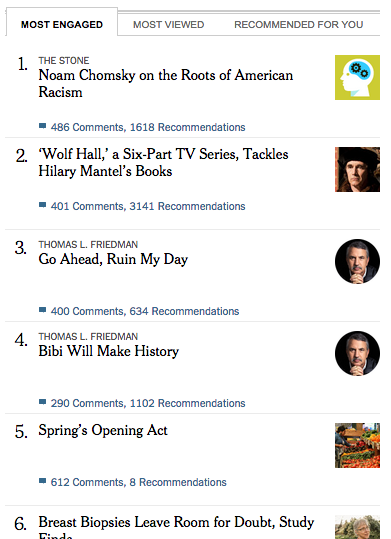

# Most Engaged 
A prototype / product description to bring a feed of most commented and recommended articles to the homepage of nytimes.com

## Why?
Community engagement is an important component of our audience engagement mandate.  Commenters are more likely to subscribe, view more pages and stay longer than any other group of users (I'm told.)  The act of commenting is part a reaction to the article, part reaction to other comments, part acknowledgement and rewarding commenting, and part simply getting people to have the commenting interface up on their screens.  Bringing a feed of "Most Engaged" articles to the recommendations ghetto is a small, simple step toward expanding presence on the homepage and gently suggesting to our users that this commenting thing is something that is important to check out and engage.

## What?
"Quit yacking, just show me."  

Ok, here's what it may look like:

## Steps forward
- When integrated into recommendations-fe, it will be easy to filter by articles the user has already read
- If/when we allow people to follow commenters, this can highlight articles that followed users have engaged with
- This feed can algorythmically be combined with Most Read and Most Emailed (and possible recommendations itself) to provide a hybrid list that may garner more engagement than individual tabs hidden behind each other.

